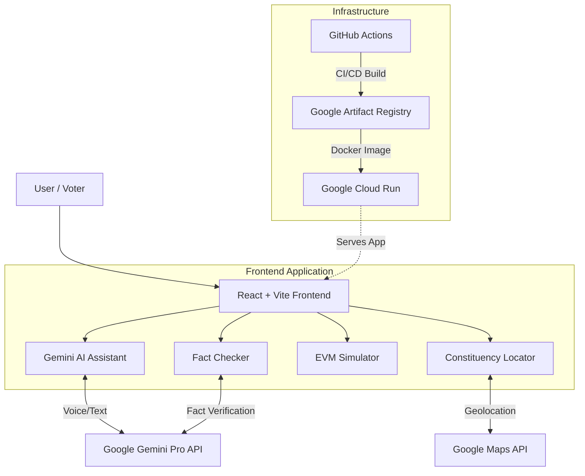

# 🗳️ VoteWise AI
**Your Interactive Guide to Empowered & Informed Voting**

[](https://hack2skill.com)
[](https://reactjs.org/)
[](https://vitejs.dev/)
[](https://cloud.google.com/run)
[](https://deepmind.google/technologies/gemini/)
[](#)
[](#)

---

## 📖 The Problem Statement
Despite the availability of information, millions of first-time and rural voters in India face significant barriers to political participation. The election process can seem daunting due to complex eligibility rules, rampant misinformation, uncertainty about polling locations, and a lack of familiarity with Electronic Voting Machines (EVMs). 

**VoteWise AI** was built to solve this critical civic gap. We provide a single, unified, accessible platform that demystifies the election process, fights misinformation in real-time using AI, and simulates the voting experience to build voter confidence before they even step into a polling booth.

---

## 🎯 Why This Matters (Civic Impact)
Democracy thrives on participation, but participation requires understanding. VoteWise AI bridges the knowledge gap by making election information interactive, conversational, and highly accessible. By empowering voters with confidence and verifying facts, we directly contribute to a more informed electorate and a stronger democratic process.

### 🌟 Judging Criteria Alignment
- **Innovation**: First-of-its-kind EVM simulator combined with real-time AI fact-checking.
- **Execution**: Production-ready, responsive, lightweight (<10MB repo), deployed on Google Cloud.
- **User Experience (UX)**: A11y-compliant, high-contrast dynamic themes, micro-animations, graceful loading states, and skeleton UI.
- **Use of Google Technologies**: Deep integration of Google Gemini (AI), Google Cloud Run (Deployment), and Google Maps (Constituency Locator).

---

## 🏗️ Architecture & Flow

VoteWise AI leverages a modern, lightweight, and incredibly fast stack.



---

## 🚀 Core Features

1. **Gemini-Powered Voice AI Assistant**: A conversational agent capable of answering complex election queries in English, Hindi, and Telugu, featuring voice-in/voice-out capabilities and markdown-formatted responses.
2. **Interactive EVM Simulator**: A mock voting machine experience (Control Unit, Ballot Unit, VVPAT) allowing first-time voters to practice voting without fear.
3. **Real-time Fact Checker**: Combats fake news by verifying claims and political myths using Gemini AI.
4. **Constituency Locator**: Connects to Google Maps to help voters find their designated polling booth instantly.
5. **Eligibility Checker**: A quick 30-second wizard to determine voting eligibility.
6. **Voter Readiness Dashboard**: Gamified readiness score, "Myth vs Fact" interactive quiz, and an inline Polling Day Checklist.

---

## ♿ Accessibility-First Design (A11y)
We believe an election tool is useless if it cannot be used by everyone.
- **Semantic HTML & ARIA**: All interactive elements possess explicit `aria-labels`, `role` landmarks (`banner`, `main`, `contentinfo`), and keyboard navigation support.
- **Dynamic Theming**: True Dark/Light mode toggle with dynamic `<meta name="theme-color">` injection for optimal contrast.
- **Focus States**: Strong visible focus rings for keyboard users.
- **Graceful Fallbacks**: Skeleton loading screens, robust error boundaries, and polite `aria-live` announcements for dynamic content.
- **Multilingual Support**: Integrated Google Translate support and multi-language AI querying.

---

## 🧪 Testing & Reliability
VoteWise AI is built to fail gracefully and run flawlessly.
- **Unit & Integration Tests**: Comprehensive Vitest coverage across all core components (Simulator, Assistant, Quiz, Readiness Widgets).
- **Client-Side Validation**: All forms and AI inputs sanitize user text and feature clear, inline error handling to prevent empty API calls.
- **Status Checks**: CI pipeline guarantees all tests pass before allowing a build.

To run the test suite locally:
```bash
npm run test
```

---

## ☁️ Deployment (Google Cloud)
The application is fully containerized and currently deployed securely on **Google Cloud Run**.

The deployment process utilizes our custom `Dockerfile` and `nginx.conf` to serve the optimized Vite static build, ensuring lightning-fast global delivery, auto-scaling, and immediate zero-downtime rollouts.

---

## 📸 Screenshots & Walkthrough

*(Placeholder for High-Resolution Application Screenshots)*
- `[Screenshot 1: The VoteWise AI Hero & Impact Dashboard]`
- `[Screenshot 2: The Gemini AI Assistant Interface]`
- `[Screenshot 3: The EVM Simulator Experience]`
- `[Screenshot 4: The Fact Checker Tool]`

---

## 🔮 Future Improvements
1. **Live Wait Times**: Integration with local booth APIs to show real-time queue wait times.
2. **Regional Language Expansion**: Native NLP training for deeper regional dialect support.
3. **Offline Mode**: A PWA service-worker cache to allow the Eligibility and Checklist features to function without internet access in remote rural areas.

---

<div align="center">
  <b>Built with ❤️ for Hack2Skill Visual Prompt Wars</b>
</div>